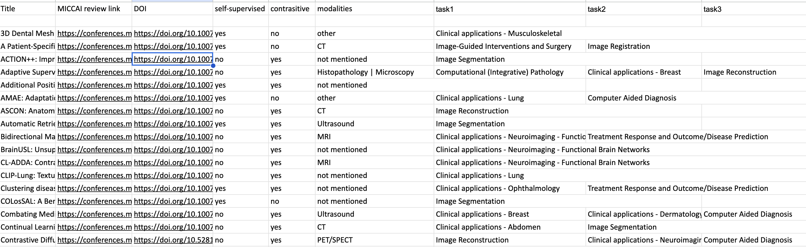

# MICCAI Crawler
This is a tool designed to crawl papers relevant to <mark>'contrastive learning'</mark> and <mark>'self-supervised learning'</mark> from MICCAI 2023. The output will contain MICCAI links, DOIs, paper titles, methodologies, modalities, and designed tasks.

This is a sample output:


Required environment:
```
pip install tqdm
pip install openpyxl
pip install requests
pip install beautifulsoup4
```

To run the script:
```
python script.py
```

To change the topics crawling, modify code below.
Tuple(0) is the key word, and Tuple(1) is the number of times it should appears in the MICCAI review sessions.
```
topics = [
    ('self-supervised', 3),
    ('contrastive', 2),
]
```

Modify this part as well if you are looking more topics:
```
self_supervised = 'yes' if 'self-supervised' in tags else 'no'
contrastive = 'yes' if 'contrastive' in tags else 'no'

ws.append([title, url, doi, self_supervised, contrastive, images_modalities])

```


Note: It uses the term 'self-supervised' three times because if a paper is 'self-supervised,' it will also appear under the 'Topics' section with the same label.

